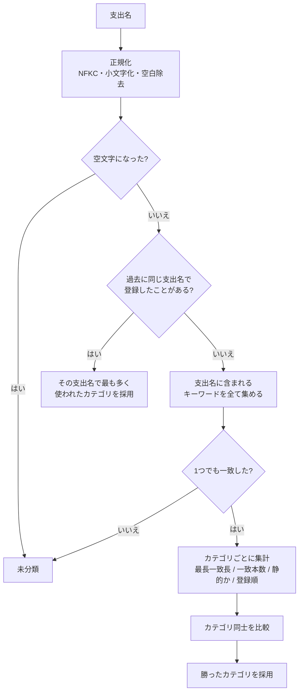
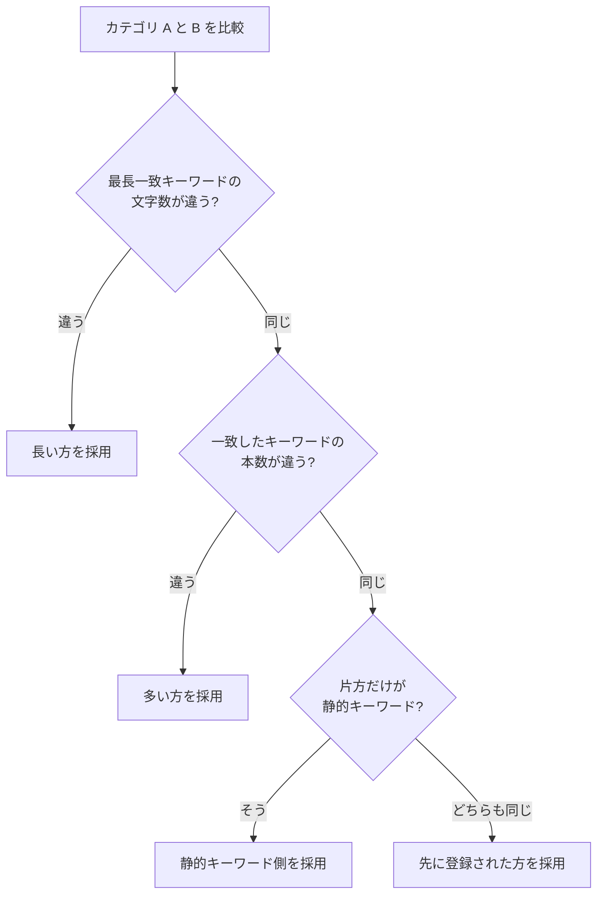
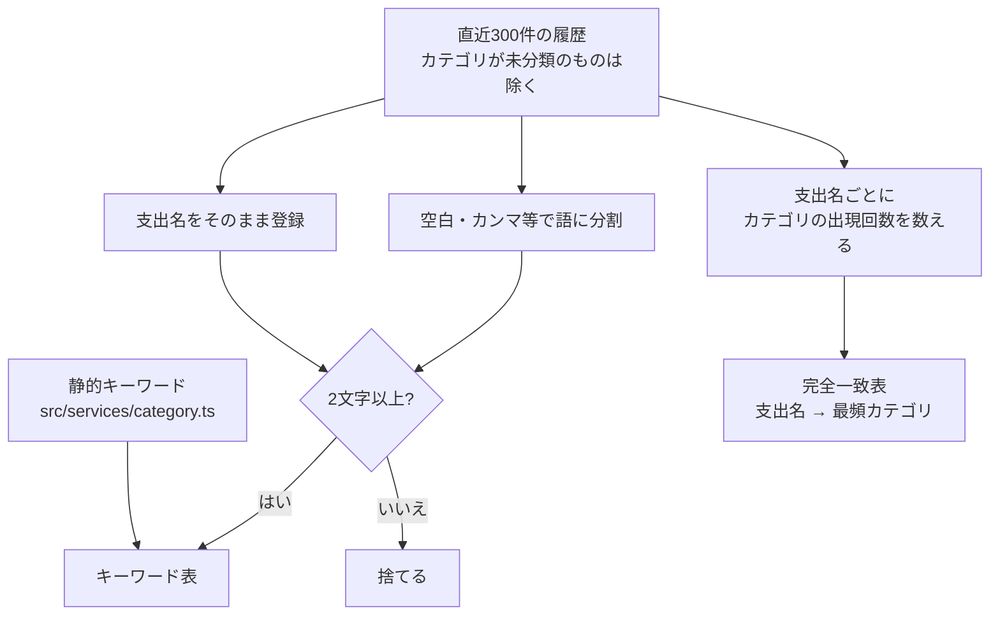

# notion-kakeibo-api

iPhone ショートカットから支出を Notion に記録するための API（Cloudflare Workers + Hono）。
設計の背景は [docs/家計簿アプリNotion統合_システム設計書.md](docs/家計簿アプリNotion統合_システム設計書.md) を参照。

## セットアップ

```bash
npm install
```

秘匿値をローカル用に用意する。

```bash
cp .dev.vars.example .dev.vars
```

| 変数 | 置き場所 | 用途 |
| --- | --- | --- |
| `NOTION_API_KEY` | secret | Notion インテグレーショントークン |
| `API_KEY` | secret | このAPIを呼び出すための認証キー |
| `NOTION_DATABASE_ID` | `wrangler.jsonc` の vars | 支出を書き込む NotionDB のID |
| `NOTION_DATASOURCE_ID` | `wrangler.jsonc` の vars | 支出のデータソースID |
| `NOTION_SUMMARY_DATA_SOURCE_ID` | `wrangler.jsonc` の vars | 月次サマリのデータソースID |

本番の secret は wrangler で登録する。

```bash
npx wrangler secret put API_KEY
```

## 開発

```bash
npm run dev
```

```bash
npm run typecheck
```

```bash
npm run check
```

`main` への push で [GitHub Actions](.github/workflows/deploy.yaml) が型チェック・フォーマットチェックを通してからデプロイする。

## 認証

`/` と `/health` 以外のエンドポイントは API キーが必要。次のどちらかで渡す。

- `X-API-Key: <API_KEY>`
- `Authorization: Bearer <API_KEY>`

キーが一致しない場合は `401`、サーバ側に `API_KEY` が設定されていない場合は `500` を返す（設定漏れのまま公開されるのを防ぐため）。

```bash
curl -X POST https://<worker>/expenses \
  -H "X-API-Key: $API_KEY" \
  -H "Content-Type: application/json" \
  -d '{"name":"ローソン 昼ごはん","amount":"¥820"}'
```

## エンドポイント

### `GET /health`

疎通確認。認証不要。

```json
{ "status": "ok" }
```

### `POST /expenses`

支出を1件登録する。購入日の月の月次サマリページがあれば、リレーションを張る。

| 項目 | 型 | 必須 | 説明 |
| --- | --- | --- | --- |
| `name` | string | ✅ | 支出名。1〜200文字 |
| `amount` | number \| string | ✅ | 金額。0以外の整数（返金記録のため負の値も可）。`"¥1,200"` `"１２００円"` のような文字列も受け付ける |
| `paymentMethod` | string |  | `カード` / `現金`。省略時は `カード` |
| `date` | string |  | 購入日。`YYYY-MM-DD`（`YYYY/MM/DD` も可）。省略時は JST の今日 |
| `category` | string |  | カテゴリ。省略時は支出名から自動決定 |

```json
{
  "success": true,
  "pageId": "1f8c1d7d-xxxx-xxxx-xxxx-xxxxxxxxxxxx",
  "url": "https://www.notion.so/...",
  "category": "日用・食費",
  "categorySource": "auto",
  "expense": {
    "name": "ローソン 昼ごはん",
    "amount": 820,
    "paymentMethod": "カード",
    "date": "2026-08-21",
    "category": "日用・食費"
  }
}
```

`categorySource` は `request`（リクエスト指定）か `auto`（自動決定）。

## エラーレスポンス

```json
{
  "success": false,
  "code": "validation_error",
  "message": "amount must be not zero",
  "requestId": "9baff8f9-7f5b-4428-93d0-d5c0954d477c",
  "errors": [{ "field": "amount", "message": "amount must be not zero" }]
}
```

| ステータス | `code` | 内容 |
| --- | --- | --- |
| 400 | `invalid_json` | ボディが JSON として解釈できない |
| 400 | `validation_error` | 入力値が不正（`errors` に全件） |
| 401 | `unauthorized` | API キーが不正 |
| 404 | `not_found` | 該当するエンドポイントがない |
| 500 | `server_misconfigured` | サーバ側に `API_KEY` が未設定 |
| 500 | `internal_error` | 想定外のエラー |
| 502 | `notion_error` | Notion API との連携に失敗 |
| 503 | `notion_error` | Notion API のレート制限・タイムアウト（時間をおいて再試行） |

`requestId` はレスポンスヘッダ `X-Request-Id` と同じ値で、ログの突き合わせに使える。
Notion のエラーメッセージはログにのみ残し、レスポンスには `notionCode` だけを載せている。

## カテゴリ自動決定ロジック

`category` を指定しなかった場合のみ動く。

### 判定の流れ



正規化を挟むので `ﾛｰｿﾝ` と `ローソン` は同じものとして扱われる。

### 同点だったときの決め方

比較は上から順に見て、**差がついた時点で決まる**。



最初の基準を**一致本数ではなく最長一致長**にしているのは、1文字の偶然の一致と
6文字の具体的な一致を同じ重みで数えたくないため。最後の「登録順」は、
どこまでいっても同点だった場合に結果を毎回同じにするための決着ルール。

### キーワードの作り方



静的キーワードは長さの足切りをしない（`服` のような1文字も使う）。
履歴由来のキーワードだけ2文字以上に絞っているのは、1文字だと無関係な支出名にも当たってしまうため。
語単位でも登録するので、「スタバ ラテ」の履歴から「スタバ」だけでも当たる。

### 具体例

履歴に `スタバ ラテ → 遊び費` がある状態での判定。

| 支出名 | 一致したキーワード | 結果 | 理由 |
| --- | --- | --- | --- |
| `スタバでご飯` | `ご飯`(2, 静的) / `スタバ`(3, 静的) | `遊び費` | 最長一致が長い方 |
| `ご飯とスタバラテ` | `ご飯`(2) / `スタバラテ`(5, 履歴) | `遊び費` | 履歴の支出名まるごとが一致 |
| `外食のご飯` | `ご飯`(2) / `外食`(2) | `日用・食費` | 長さも本数も同じ。静的同士なので登録順で決着 |
| `謎の支出` | なし | `未分類` | |

`スタバでご飯` は、一致本数だけで比べていた従来のロジックでは `日用・食費` になっていた
（どちらも1本で並び、宣言順で先に来る方が勝っていた）。

### そのほか

- 学習に使うのは**直近300件**の履歴。全件を走査すると支出が増えるほど登録が遅くなるため。
- 履歴の取得に失敗した場合は静的キーワードだけで判定し、**登録自体は通す**。

## Notion API 呼び出し

Notion 呼び出しは SDK の設定で 10 秒タイムアウト・最大2回リトライにしている。
SDK は 429 と冪等なメソッドの 5xx のみを `Retry-After` 準拠で再送するため、支出登録の POST が二重に走ることはない。
