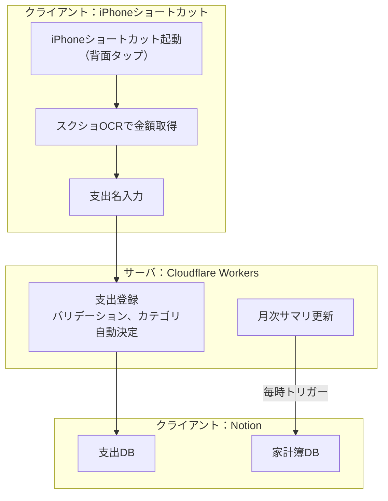
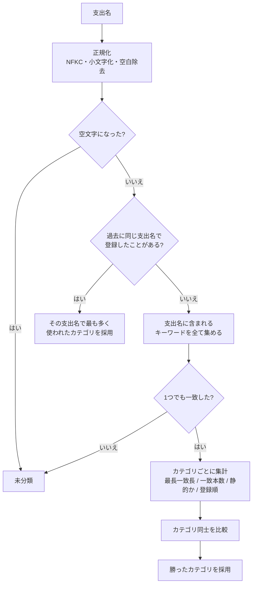
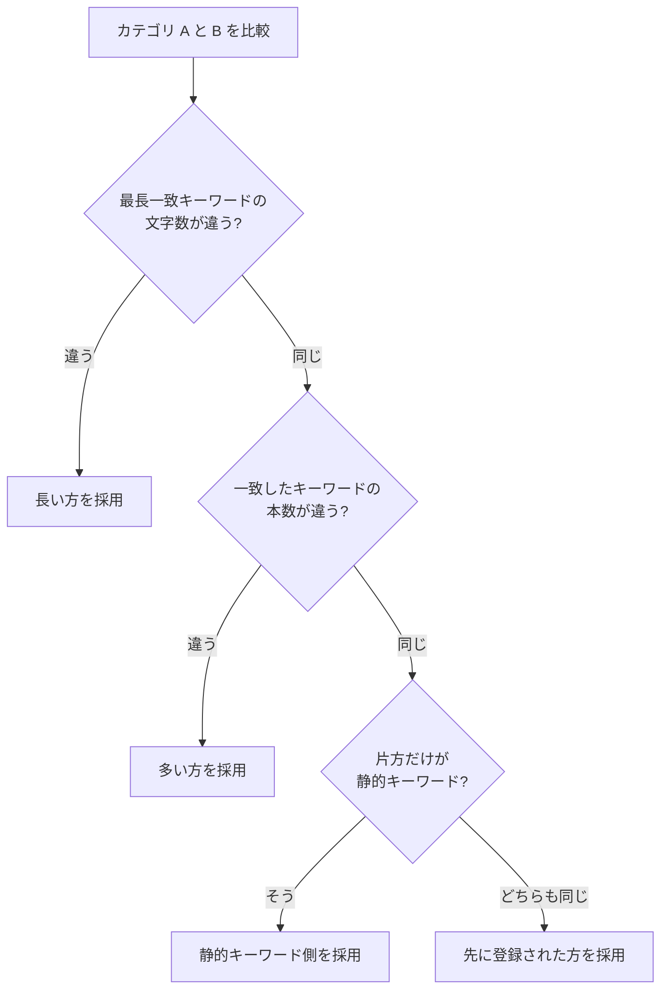
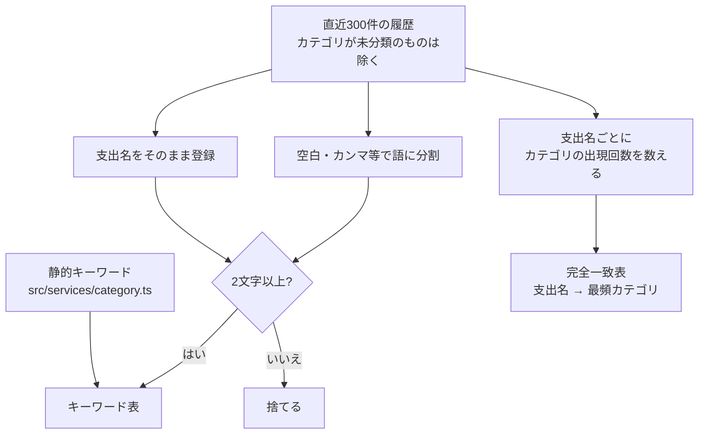

# notion-kakeibo-api

**完全自分用サービス。** \
iPhoneショートカットから手間なくに支出を記録。Notionで家計簿管理。 \

## 家計簿管理フロー

支出の記録に必要な作業は2つだけ。
- iPhoneで背面タップ
- 支出名を入力

あとは、スクショから金額取得、Notion家計簿に登録、月次サマリ更新まで自動でやってくれます。



## 認証

`/` と `/health` 以外のエンドポイントは API キーが必要。次のどちらかで渡す。

- `X-API-Key: <API_KEY>`
- `Authorization: Bearer <API_KEY>`

キーが一致しない場合は `401`、サーバ側に `API_KEY` が設定されていない場合は `500` を返す（設定漏れのまま公開されるのを防ぐため）。

```bash
curl -X POST https://<worker>/expenses \
  -H "X-API-Key: $API_KEY" \
  -H "Content-Type: application/json" \
  -d '{"name":"ローソン 昼ごはん","amount":"¥820"}'
```

## エンドポイント

### `GET /health`

疎通確認。認証不要。

```json
{ "status": "ok" }
```

### `GET /categories`

登録できるカテゴリと支払い方法の一覧。iPhone ショートカットの選択肢を組み立てるのに使う。

```json
{
  "success": true,
  "categories": ["日用・食費", "居住費", "生活費", "遊び費", "仕事勉強費", "旅行費", "特別費", "投資"],
  "uncategorized": "未分類",
  "paymentMethods": ["カード", "現金"]
}
```

### `POST /expenses`

支出を1件登録する。購入日の月の月次サマリページがあれば、リレーションを張る。

| 項目 | 型 | 必須 | 説明 |
| --- | --- | --- | --- |
| `name` | string | ✅ | 支出名。1〜200文字 |
| `amount` | number \| string | ✅ | 金額。0以外の整数（返金記録のため負の値も可）。`"¥1,200"` `"１２００円"` のような文字列も受け付ける |
| `paymentMethod` | string |  | `カード` / `現金`。省略時は `カード` |
| `date` | string |  | 購入日。`YYYY-MM-DD`（`YYYY/MM/DD` も可）。省略時は JST の今日 |
| `category` | string |  | カテゴリ。省略時は支出名から自動決定 |

```json
{
  "success": true,
  "pageId": "1f8c1d7d-xxxx-xxxx-xxxx-xxxxxxxxxxxx",
  "url": "https://www.notion.so/...",
  "category": "日用・食費",
  "categorySource": "auto",
  "expense": {
    "name": "ローソン 昼ごはん",
    "amount": 820,
    "paymentMethod": "カード",
    "date": "2026-08-21",
    "category": "日用・食費"
  }
}
```

`categorySource` は `request`（リクエスト指定）か `auto`（自動決定）。


### `POST /summary`

指定した月次サマリページを今すぐ最新化する。`pageid` はクエリかボディで渡す。

通常は後述の定期実行に任せればよく、これは「1時間待たずに今すぐ反映したい」場合の手動トリガ。
Notion のボタン Webhook（有料プラン限定）を向ける先としても使える。

```json
{
  "success": true,
  "pageId": "38fa4e54a1b5815db547e5c633f32f54",
  "title": "2026.07",
  "month": "2026-07",
  "status": "unchanged",
  "updatedAt": "2026-08-22 12:07"
}
```

`status` は `created`（新規作成）／`updated`（内容を更新）／`unchanged`（変化なしで何も書いていない）。

## サマリページの自動更新

毎時0分に Cloudflare の Cron Trigger が動き、**今月と前月**のサマリページを最新化する。
前月も見るのは、月初に前月の資産額を後から記入することが多く、今月だけだと取りこぼすため。

これにより、次のどちらの順序でもサマリが完成する。

1. 先に資産額を記入 → 定期実行 → 完成
2. 定期実行 → 記入できている範囲のサマリ → 後から資産額を記入 → 次の定期実行で完成
   （待てない場合は `POST /summary` で即時反映できる）

NotionDB「家計簿」の数式プロパティ `🔄️サマリ更新` はこの仕組みでは使わない。
ブラウザからリンクを開く経路では認証ヘッダを付けられず、URL に API キーを載せる必要があったため、
定期実行に一本化して廃止した。

## エラーレスポンス

```json
{
  "success": false,
  "code": "validation_error",
  "message": "amount must be not zero",
  "requestId": "9baff8f9-7f5b-4428-93d0-d5c0954d477c",
  "errors": [{ "field": "amount", "message": "amount must be not zero" }]
}
```

| ステータス | `code` | 内容 |
| --- | --- | --- |
| 400 | `invalid_json` | ボディが JSON として解釈できない |
| 400 | `validation_error` | 入力値が不正（`errors` に全件） |
| 400 | `not_a_summary_page` | 指定ページが月次サマリのデータソース配下にない |
| 400 | `summary_page_unavailable` | サマリページを読み取れない |
| 401 | `unauthorized` | API キーが不正 |
| 404 | `not_found` | 該当するエンドポイントがない |
| 500 | `server_misconfigured` | サーバ側に `API_KEY` が未設定 |
| 500 | `internal_error` | 想定外のエラー |
| 502 | `notion_error` | Notion API との連携に失敗 |
| 503 | `notion_error` | Notion API のレート制限・タイムアウト（時間をおいて再試行） |

`requestId` はレスポンスヘッダ `X-Request-Id` と同じ値で、ログの突き合わせに使える。
Notion のエラーメッセージはログにのみ残し、レスポンスには `notionCode` だけを載せている。

## カテゴリ自動決定ロジック

`category` を指定しなかった場合のみ動く。

### 判定の流れ



正規化を挟むので `ﾛｰｿﾝ` と `ローソン` は同じものとして扱われる。

### 同点だったときの決め方

比較は上から順に見て、**差がついた時点で決まる**。



最初の基準を**一致本数ではなく最長一致長**にしているのは、1文字の偶然の一致と
6文字の具体的な一致を同じ重みで数えたくないため。最後の「登録順」は、
どこまでいっても同点だった場合に結果を毎回同じにするための決着ルール。

### キーワードの作り方



静的キーワードは長さの足切りをしない（`服` のような1文字も使う）。
履歴由来のキーワードだけ2文字以上に絞っているのは、1文字だと無関係な支出名にも当たってしまうため。
語単位でも登録するので、「スタバ ラテ」の履歴から「スタバ」だけでも当たる。

### 具体例

履歴に `スタバ ラテ → 遊び費` がある状態での判定。

| 支出名 | 一致したキーワード | 結果 | 理由 |
| --- | --- | --- | --- |
| `スタバでご飯` | `ご飯`(2, 静的) / `スタバ`(3, 静的) | `遊び費` | 最長一致が長い方 |
| `ご飯とスタバラテ` | `ご飯`(2) / `スタバラテ`(5, 履歴) | `遊び費` | 履歴の支出名まるごとが一致 |
| `外食のご飯` | `ご飯`(2) / `外食`(2) | `日用・食費` | 長さも本数も同じ。静的同士なので登録順で決着 |
| `謎の支出` | なし | `未分類` | |

`スタバでご飯` は、一致本数だけで比べていた従来のロジックでは `日用・食費` になっていた
（どちらも1本で並び、宣言順で先に来る方が勝っていた）。