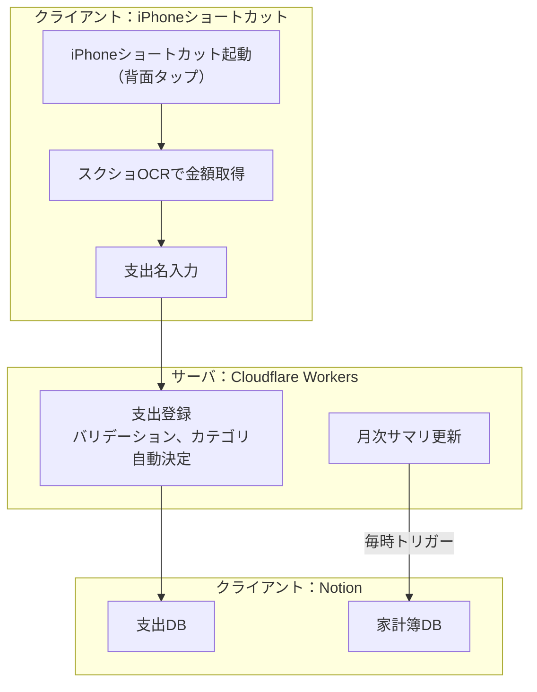

# notion-kakeibo-api

**完全自分用サービス。** \
iPhoneショートカットから手間なくに支出を記録。Notionで家計簿管理。

## 家計簿管理フロー

支出の記録に必要な作業は2つだけ。
- iPhoneで背面タップ
- 支出名を入力

あとは、スクショから金額取得、Notion家計簿に登録、月次サマリ更新まで自動でやってくれます。



## エンドポイント

| メソッド | パス | 内容 | 認証 |
| --- | --- | --- | --- |
| `GET` | `/` | 死活確認。`OK` を返すだけ | 不要 |
| `GET` | `/health` | 疎通確認 | 不要 |
| `GET` | `/categories` | 登録できるカテゴリと支払い方法の一覧 | 必要 |
| `POST` | `/expenses` | 支出を1件登録する | 必要 |
| `POST` | `/summary` | 指定した月次サマリページを今すぐ最新化する | 必要 |

リクエスト項目とレスポンスは [docs/エンドポイント.md](docs/エンドポイント.md) を参照。

## エラーレスポンス

```json
{
  "success": false,
  "code": "validation_error",
  "message": "amount must be not zero",
  "requestId": "9baff8f9-7f5b-4428-93d0-d5c0954d477c",
  "errors": [{ "field": "amount", "message": "amount must be not zero" }]
}
```

| ステータス | `code` | 内容 |
| --- | --- | --- |
| 400 | `invalid_json` | ボディが JSON として解釈できない |
| 400 | `validation_error` | 入力値が不正（`errors` に全件） |
| 400 | `not_a_summary_page` | 指定ページが月次サマリのデータソース配下にない |
| 400 | `summary_page_unavailable` | サマリページを読み取れない |
| 401 | `unauthorized` | API キーが不正 |
| 404 | `not_found` | 該当するエンドポイントがない |
| 500 | `server_misconfigured` | サーバ側に `API_KEY` が未設定 |
| 500 | `internal_error` | 想定外のエラー |
| 502 | `notion_error` | Notion API との連携に失敗 |
| 503 | `notion_error` | Notion API のレート制限・タイムアウト（時間をおいて再試行） |

`requestId` はレスポンスヘッダ `X-Request-Id` と同じ値で、ログの突き合わせに使える。
Notion のエラーメッセージはログにのみ残し、レスポンスには `notionCode` だけを載せている。

