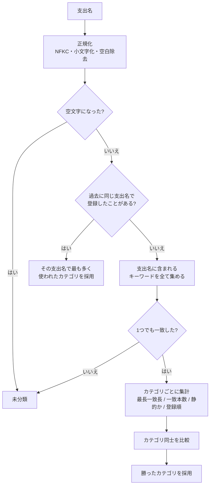
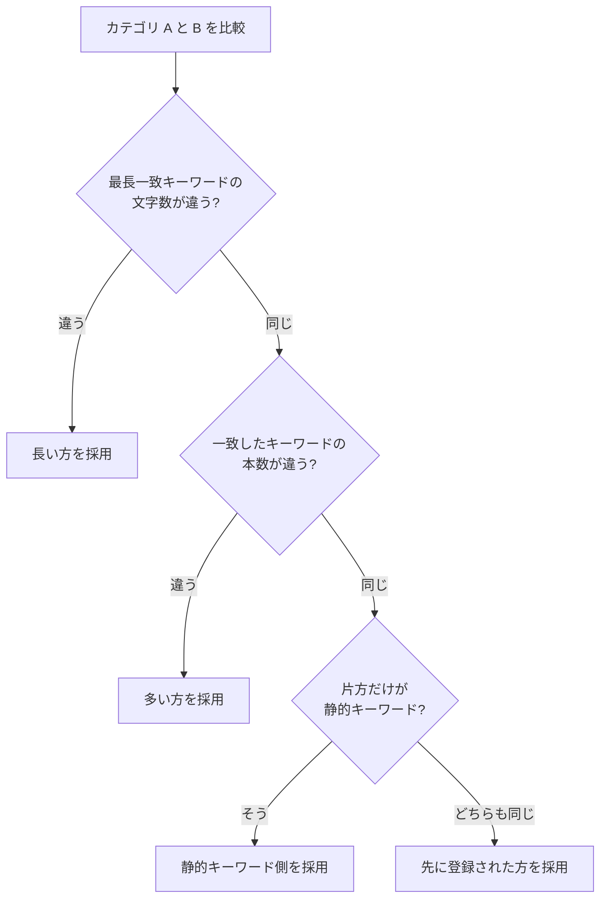
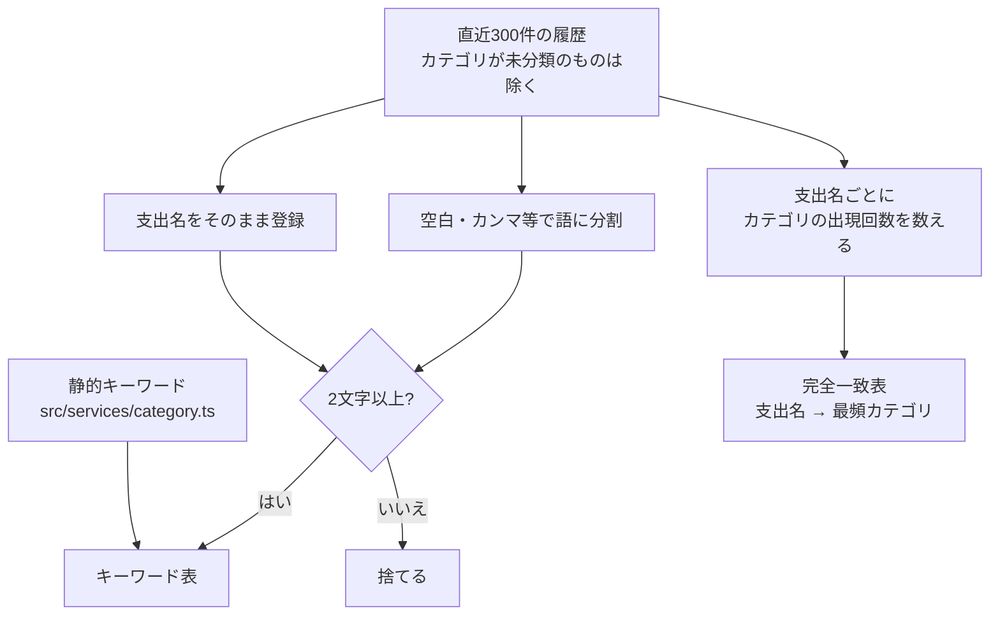

# カテゴリ自動決定

判定の流れ・同点時の決め方・キーワードの作り方は [README](../README.md#カテゴリ自動決定ロジック) を正とする。
ここにはそこに書かなかった判断だけを置く。

- 学習に使うのは**直近300件**の履歴。全件を走査すると支出が増えるほど登録が遅くなるため。
- 履歴の取得に失敗した場合は静的キーワードだけで判定し、**登録自体は通す**。

## カテゴリ自動決定ロジック

`category` を指定しなかった場合のみ動く。

### 判定の流れ

正規化を挟むので `ﾛｰｿﾝ` と `ローソン` は同じものとして扱われる。

### 同点だったときの決め方

比較は上から順に見て、**差がついた時点で決まる**。

最初の基準を**一致本数ではなく最長一致長**にしているのは、1文字の偶然の一致と
6文字の具体的な一致を同じ重みで数えたくないため。最後の「登録順」は、
どこまでいっても同点だった場合に結果を毎回同じにするための決着ルール。

### キーワードの作り方

静的キーワードは長さの足切りをしない（`服` のような1文字も使う）。
履歴由来のキーワードだけ2文字以上に絞っているのは、1文字だと無関係な支出名にも当たってしまうため。
語単位でも登録するので、「スタバ ラテ」の履歴から「スタバ」だけでも当たる。

### 具体例

履歴に `スタバ ラテ → 遊び費` がある状態での判定。

| 支出名 | 一致したキーワード | 結果 | 理由 |
| --- | --- | --- | --- |
| `スタバでご飯` | `ご飯`(2, 静的) / `スタバ`(3, 静的) | `遊び費` | 最長一致が長い方 |
| `ご飯とスタバラテ` | `ご飯`(2) / `スタバラテ`(5, 履歴) | `遊び費` | 履歴の支出名まるごとが一致 |
| `外食のご飯` | `ご飯`(2) / `外食`(2) | `日用・食費` | 長さも本数も同じ。静的同士なので登録順で決着 |
| `謎の支出` | なし | `未分類` | |

`スタバでご飯` は、一致本数だけで比べていた従来のロジックでは `日用・食費` になっていた
（どちらも1本で並び、宣言順で先に来る方が勝っていた）。
